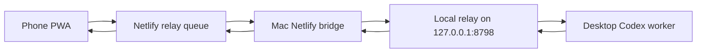

# Codex Bridge MVP Runbook

Last updated: 2026-06-21

## Current Architecture



The public relay is only a text queue. The Mac owns local filesystem access and task handling.

## Local Phone Pairing

Open the desktop pairing page on the Mac:

```text
http://127.0.0.1:8798/pairing
```

This page shows the LAN app URL, public URL, current local pairing code, and relay status. It only exposes pairing details through the loopback-only endpoint `/api/relay/local/pairing`.

The desktop pairing page also renders a local QR code for the LAN app URL. Scan it from the phone, then enter the pairing code shown next to the QR code. It shows the local, stable Netlify, and temporary tunnel app versions so stale public deploys are visible before you pair the phone.

Command-line equivalent:

Run:

```sh
cd "/Users/vincentpan/Library/Application Support/CodexRelayCloud"
node scripts/cloud-relay-install.cjs pairing
```

Use the returned `lan_app_url` on the phone when phone and Mac are on the same Wi-Fi.

Current verified LAN URL:

```text
http://192.168.0.115:8798/relay-chat.html
```

Current local pairing code:

```text
relay-2ac288ea
```

## Public Phone Pairing

Run:

```sh
cd "/Users/vincentpan/Library/Application Support/CodexRelayCloud"
node scripts/cloud-relay-netlify-bridge.cjs pairing
```

Use the returned `public_url` or `device_tab_url` on the phone.

Current verified public URL:

```text
https://codex-bridge-relay.netlify.app/relay-chat.html
```

If the phone was paired before the 2026-06-20 redeploy, open the reset URL once before pairing:

```text
https://codex-bridge-relay.netlify.app/relay-chat.html?reset=1
```

Current public pairing code:

```text
pair_J9O6Z9H9N5njyEaaCFrqV5SF
```

## Temporary Public Tunnel

The stable daily public path is Netlify. The installed `localhost.run` tunnel remains a direct fallback to the local relay:

```sh
cd "/Users/vincentpan/Library/Application Support/CodexRelayCloud"
node scripts/cloud-relay-localhostrun-install.cjs status
node scripts/cloud-relay-localhostrun-install.cjs repair
```

Current verified tunnel URL:

```text
https://2d20efdf8c3202.lhr.life/relay-chat.html
```

Use the local pairing code with this tunnel, because it is forwarding directly to the local relay:

```text
relay-2ac288ea
```

The tunnel URL is public and temporary. It stays useful while the Mac is awake and the SSH tunnel remains connected. It is not an offline queue; use the Netlify public relay for stable mobile access and queueing messages while the Mac is asleep.

## Pairing Code Troubleshooting

If the phone shows `Invalid relay pairing code`, the most common cause is mixing the two relay modes:

| Phone page opened | Code to enter | Code prefix |
| --- | --- | --- |
| `http://192.168.0.115:8798/relay-chat.html` or desktop QR | Local pairing code from `http://127.0.0.1:8798/pairing` | `relay-` |
| `https://codex-bridge-relay.netlify.app/relay-chat.html` | Public pairing code from `cloud-relay-netlify-bridge.cjs pairing` | `pair_` |

The local LAN page rejects `pair_...` codes, and the public Netlify page rejects `relay-...` codes. If the phone browser has an old token or cached page, open the reset URL or tap `清除旧登录` / `重置这台手机`, then reopen the exact URL for the mode you want to use.

Public reset URL:

```text
https://codex-bridge-relay.netlify.app/relay-chat.html?reset=1
```

The reset flow revokes the current cloud mobile token, then removes the saved local token, cursor, pending reply cache, unsent outbox, old service worker, and old PWA caches for this origin. After reset, the local/LAN/tunnel setup page should show version `2026.06.21.10`; the current stable Netlify deploy can still show version `2026.06.21.8` until account credits allow the next deploy. Make sure the mode matches the code you enter before pairing.

When the app opens with an existing token, it calls `/api/relay/mobile/transcript` before live polling. This restores the latest bidirectional messages, including your phone's outgoing text and the cloud/desktop replies, so a refresh or mobile browser restart does not leave the chat blank.

Every mobile send includes a `client_message_id`. The relay treats repeated posts from the same phone with the same `client_message_id` as the same message, and the phone UI ignores a rapid duplicate tap of the same text. This prevents network retries or accidental double taps from creating duplicate worker tasks.

The browser keeps a stable `codexRelayCloudInstanceId` outside the reset keys. Re-pairing from the same phone replaces the old active token for that phone instance, reducing stale active devices without affecting other phones.

The phone app also asks the relay to disable older active tokens with the same display name when you reconnect. This is limited to phone-initiated registration and keeps repeated `Vincent iPhone` pairings from making the status device count look inflated.

If the phone loses network while sending, the app stores the text and `client_message_id` in a capped local outbox. The outbox is retried on focus, visibility resume, browser `online`, and healthy polling. A reset clears this outbox intentionally.

While a message is pending, the phone checks `/api/relay/mobile/message-status` for that exact `relay_id`. The endpoint is scoped to the paired phone token and reports `queued`, `consumed`, `working`, or `completed`, so the app can distinguish cloud receipt, desktop bridge consumption, worker progress, and final reply without exposing desktop or mobile tokens.

Relay state is compacted on every write so long-running daily use does not grow the queue state without bound. The compaction keeps pending commands, active devices, worker replies still marked `working`, replies linked to retained commands, and the recent transcript window. Disabled device history and old terminal commands are capped after they are no longer needed for recovery or audit context.

Automated checks and the Netlify bridge use temporary mobile registrations. Current scripts revoke those temporary tokens after synchronous checks complete; slow pending bridge work keeps the local token only until the final reply or timeout. To clean historical verification devices from older runs, use the desktop-only cleanup command:

```sh
cd "/Users/vincentpan/Library/Application Support/CodexRelayCloud"
node scripts/cloud-relay-netlify-bridge.cjs cleanup-devices 0
```

The cleanup command only matches known verification device names such as `installed-*`, `netlify-fixed-e2e-*`, and `netlify:*`; it does not target normal names like `Vincent iPhone`.

## Commands Supported From Phone

| Phone text | Local effect |
| --- | --- |
| `状态` or `/status` | Return immediate cloud/desktop queue status, then queue a local worker status reply. |
| `诊断` | Queue a health check and return worker status. |
| `报告` or `/report` | Ask the Mac worker to read latest local manual report candidate. |
| `信号 BTC` | Queue `current_signal_probe` in dry-run mode. |
| `多源 BTC SOL` | Queue `multisource_snapshot` in dry-run mode. |
| `周目标 BTC SOL` | Queue `weekly_goal_lab` in dry-run mode. |
| `确认 act-...` | Write an audit-only action decision. No order. |
| `稍后 act-...` | Write an audit-only delay decision. No order. |
| `忽略 act-...` | Write an audit-only ignore decision. No order. |

The `状态` cloud reply reports device counts as active / total / disabled, so historical revoked test devices do not look like currently usable phones.

## In-App Self Check

After pairing, tap `唤醒` in the phone app. The app checks three stages:

1. Cloud/local relay API can answer `/api/relay/status`.
2. The phone has a valid paired device token.
3. A `诊断` message reaches the desktop worker and returns to the phone.

If the third stage times out, inspect the Mac side with:

```sh
cd "/Users/vincentpan/Library/Application Support/CodexRelayCloud"
node scripts/cloud-relay-install.cjs status
node scripts/cloud-relay-netlify-bridge.cjs status
```

The phone keeps tracking the diagnostic message after the 30-second warning. If the Mac was waking up slowly and the terminal worker reply arrives later, the self-check panel changes from warning back to pass and records the delayed recovery instead of leaving a stale failure state.

If `/api/relay/status` shows `queued_commands=0` but `unresolved_commands` stays above zero after a pre-fix or interrupted bridge run, the bridge can safely close only stale commands already consumed by desktop polling:

```sh
cd "/Users/vincentpan/Library/Application Support/CodexRelayCloud"
node scripts/cloud-relay-netlify-bridge.cjs reconcile
```

For an explicit one-time cleanup of known historical residue, pass `0` or `now`:

```sh
node scripts/cloud-relay-netlify-bridge.cjs reconcile 0
```

The reconcile path requires the desktop token, only closes messages already confirmed consumed by the bridge heartbeat, writes an audit trail, and posts a visible history-closure reply. It does not execute trades or monitor tasks.

## Verification Commands

Local:

```sh
cd "/Users/vincentpan/Library/Application Support/CodexRelayCloud"
node scripts/cloud-relay-install.cjs status
node scripts/cloud-relay-install.cjs e2e '状态'
```

Public:

```sh
cd "/Users/vincentpan/Library/Application Support/CodexRelayCloud"
node scripts/cloud-relay-netlify-bridge.cjs status
node scripts/cloud-relay-netlify-bridge.cjs e2e '状态'
node scripts/cloud-relay-netlify-bridge.cjs continuity
node scripts/cloud-relay-netlify-bridge.cjs reconcile
```

Development package:

```sh
cd "/Users/vincentpan/Documents/investing/mobile-investment-console"
npm run check
npm test
npm run local:install
```

Installed runtime:

```sh
cd "/Users/vincentpan/Library/Application Support/CodexRelayCloud"
node scripts/cloud-relay-doctor.cjs
node scripts/cloud-relay-doctor.cjs --e2e
node scripts/cloud-relay-netlify-bridge.cjs e2e '状态'
node scripts/cloud-relay-netlify-bridge.cjs continuity
node /private/tmp/relay-playwright/relay-ui-check.mjs
node /private/tmp/relay-playwright/relay-instance-replace-check.mjs
node /private/tmp/relay-playwright/relay-public-instance-replace-check.mjs
node /private/tmp/relay-playwright/relay-outbox-retry-check.mjs
node /private/tmp/relay-playwright/relay-receipt-local-check.mjs
node /private/tmp/relay-playwright/relay-receipt-public-check.mjs
node /private/tmp/relay-playwright/relay-public-chat-continuity-check.mjs
node scripts/cloud-relay-netlify-bridge.cjs cleanup-devices 0
```

`doctor` checks the local app, desktop pairing page, QR vendor, loopback pairing API, docs, public bridge status, temporary tunnel, and awake helper. `doctor --e2e` additionally sends a local diagnostic, a public report request, and a five-message public continuity sequence. The Netlify bridge e2e sends a real `状态` message through the public relay, confirms the local worker consumes it, verifies the reply returns to the public queue, and revokes its temporary public mobile token. `continuity` sends five real Netlify messages in sequence (`状态`, `报告`, `诊断`, `状态`, `报告`) and verifies every message reaches `completed` with a terminal worker reply, catching the "only replies once" class of regressions. The UI check pairs a temporary local phone in mobile and desktop viewports, sends `状态`, verifies the worker reply, and saves screenshots; it should use a temporary display name such as `Playwright iPhone ...`, not the real phone name. The instance replacement checks re-pair from the same browser/client instance locally and through Netlify, then verify the old token becomes 401 while the new token remains valid. The outbox check simulates an offline send, verifies local storage keeps the message, restores network, and verifies automatic retry clears the outbox. The receipt checks send `状态` through the installed local service and Netlify public service, then verify the message status endpoint reaches `completed`. The public chat continuity check opens the real Netlify phone page, pairs it, sends `状态` and `报告`, waits for terminal worker replies for both, and verifies there are no browser console issues. The cleanup command disables historical verification devices so status counts remain readable.

Tunnel:

```sh
cd "/Users/vincentpan/Library/Application Support/CodexRelayCloud"
node scripts/cloud-relay-localhostrun-install.cjs status
node scripts/cloud-relay-localhostrun-install.cjs e2e '诊断'
```

Keep-awake helper:

```sh
cd "/Users/vincentpan/Library/Application Support/CodexRelayCloud"
node scripts/cloud-relay-awake-install.cjs status
```

The keep-awake LaunchAgent runs `caffeinate -ims` so the relay is less likely to idle-sleep while the user session is active.

## Deployment Note

Latest successful Netlify production deploy:

```text
6a3770f49529294af075ee70
```

Later deploy attempts `6a37729c8ad80d76f3966a44` and `6a37804334af399f98db2849` were skipped by Netlify with `account credit usage exceeded`. The Mac-installed runtime has the latest frontend/runtime fixes; publishing that exact final version to Netlify requires the Netlify account credit limit to be cleared. The current live Netlify app remains healthy and usable, but the desktop pairing page should be treated as the source of truth for whether the stable public UI is current.

## Sleep And Wake Boundary

The phone web app cannot physically wake a Mac that is already asleep or lid-closed. Current behavior:

| Mac state | Expected result |
| --- | --- |
| Awake, logged in, network connected | LAN, tunnel, and Netlify bridge replies can complete normally. |
| Idle but lid open | `cloud-relay-awake-install.cjs install` keeps a `caffeinate -ims` assertion active to reduce idle sleep. |
| Just woke from sleep | Phone messages may already be queued; tap `唤醒` or send `诊断` to force a fresh round trip. |
| Lid closed / deep sleep | The web page cannot wake the Mac. Netlify can queue text, but the Mac replies only after it wakes through normal macOS/hardware mechanisms. |

Current power settings show sleep is still configured by macOS. The keep-awake helper improves the open-lid case; closed-lid reliability requires hardware clamshell support, power, and macOS wake/network settings outside this web app.

## Hosting Options

| Option | Fit | Tradeoff |
| --- | --- | --- |
| Keep current Netlify public relay | Best daily path. Stable URL, HTTPS, phone can use cellular data, and local Mac bridge can queue/consume. | Mac must be awake to complete replies; while asleep, messages wait in the cloud queue. |
| Keep LAN PWA on `8798` | Best local fallback. New UI is installed and verified. | Phone must be on the same Wi-Fi. |
| Use `localhost.run` tunnel | Direct cellular fallback to the local UI. | Mac must be awake; anonymous URL may change. |
| Cloudflare quick tunnel | Useful for a temporary public demo. | URL is temporary and not stable enough for daily use. |
| Authenticated Cloudflare Tunnel | Good stable replacement if account is configured. | Needs Cloudflare login/domain setup. |
| Tauri desktop wrapper later | Good for native desktop controls and tray status. | Does not solve mobile public hosting by itself. |

## Safety Boundary

- `live_orders_enabled=false`
- `withdrawals_enabled=false`
- Cloud relay stores text queue state only.
- No exchange credentials in the phone page.
- Local worker is dry-run for monitor scripts unless explicitly changed later.
